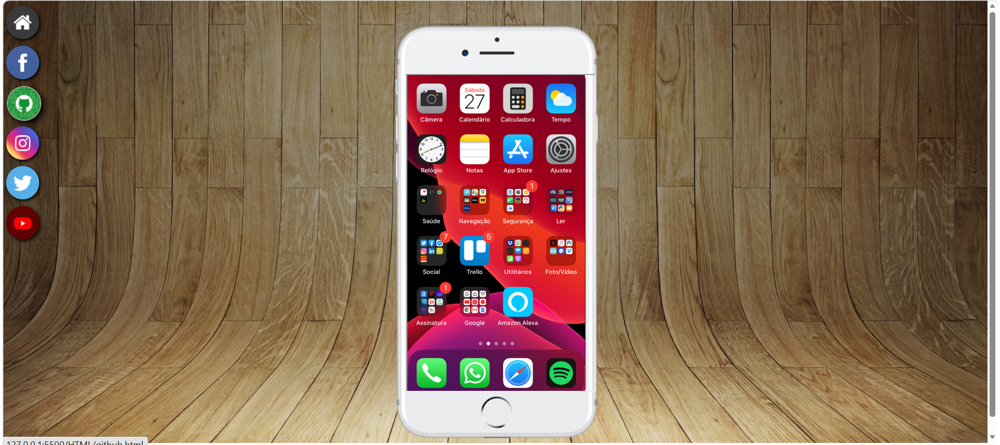

# 🌐 Social Hub - Agregador de Redes Sociais

## 📖 Sobre o Projeto

O **Social Hub** é um agregador de redes sociais que centraliza o acesso a diferentes plataformas em uma única interface. O projeto simula um ambiente onde o usuário pode navegar entre várias redes sociais através de um menu de ícones, visualizando o conteúdo em um **iframe central**.

---

## 🎨 Layout e Estrutura

### Interface Principal

| Elemento | Descrição |
|----------|-----------|
| **Iframe Central** | Área principal que exibe o conteúdo das redes sociais |
| **Menu de Navegação** | Ícones das redes sociais para navegação |
| **Design Limpo** | Layout minimalista focado na funcionalidade |

### Redes Sociais Integradas

| Ícone | Rede Social | Arquivo |
|-------|-------------|---------|
| 🏠 | Home (Tela Inicial) | `home.html` |
| 📘 | Facebook | `facebook.html` |
| 🐙 | GitHub | `github.html` |
| 📸 | Instagram | `instagram.html` |
| 🐦 | Twitter | `twitter.html` |
| ▶️ | YouTube | `youtube.html` |

---

## 🖼️ Preview do Projeto

### Visualização Desktop

| Dispositivo | Screenshot |
|-------------|------------|
| **Desktop** |  |


---

## 🛠️ Tecnologias Utilizadas

| Tecnologia | Descrição |
|------------|-----------|
| **HTML5** | Estrutura da página |
| **CSS3** | Estilização e layout |
| **Iframe** | Exibição de conteúdo externo/interno |
| **Target Attribute** | Navegação entre páginas |


---

## 🎯 Funcionalidades

### 1. Navegação por Iframe
- **Clique no ícone** → Carrega a página correspondente no iframe
- **Atributo `target="tela"`** → Controla onde o conteúdo é exibido
- **Navegação suave** sem recarregar a página principal

### 2. Menu de Ícones
- **Ícones circulares** ou retangulares com logos das redes
- **Links externos** com `target="_blank"` ou internos com `target="tela"`
- **Design consistente** para todos os ícones

### 3. Interface Responsiva
- Adaptação para diferentes tamanhos de tela
- Layout otimizado para mobile e desktop

---

## 💻 Código de Navegação

```
    <!-- Estrutura do iframe -->
    <iframe 
        src="HTML/home.html" 
        frameborder="1" 
        name="tela" 
        id="tela">
        Seu navegador não é compatível
    </iframe>

    <!-- Ícones de navegação -->
    <a href="HTML/home.html" target="tela">
        
    </a>
```